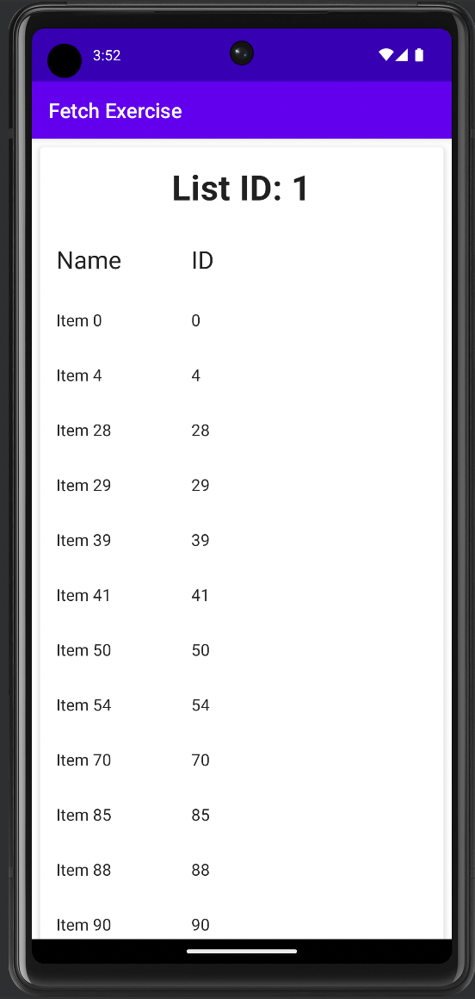

# Fetch Exercise

This is an Android Application that fetches the data from https://fetch-hiring.s3.amazonaws.com/hiring.json 
and displays it to the user in an easy to read format.

## Getting Started

To run this application, clone the repo, open it in Android Studio, and click "Run". There is no user
interaction necessary - 

### Dependencies

This application uses [Retrofit](https://square.github.io/retrofit/) to fetch the data that is displayed.

## Testing

There are simple unit tests for the data modeling/formatting functions.

## License

[MIT License](license)